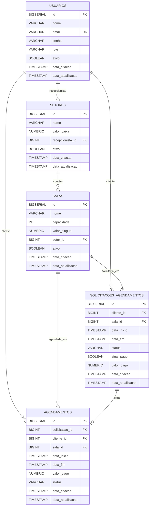

# ReservaSalas: Sistema de Gerenciamento de Espaços

O **ReservaSalas** é um sistema monolítico completo para agendamento de salas, desenvolvido em **Java Spring Boot** e **JSP**. A solução foi criada para otimizar o processo de reservas, oferecendo ferramentas especializadas para três perfis de usuário: **Administrador**, **Recepcionista** e **Cliente**.

-----

## 🛠️ Stack Tecnológica

  * **Backend:** Java Spring Boot (MVC) 
  * **View:** Java Server Pages (JSP) 
  * **Banco de Dados:** PostgreSQL 
  * **Versionamento de BD:** Flyway 

-----

## ✨ Funcionalidades

O sistema foi desenhado para atender aos requisitos de cada perfil, garantindo uma experiência completa e segura.

  * **Gerenciamento de Perfis:**

      * **Cadastro:** Apenas novos Clientes podem se cadastrar livremente. Recepcionistas são adicionados pelo Administrador, e um Administrador padrão é definido via *seed* no DataLoader.java.
      * **Autenticação e Autorização:** Controle de acesso baseado em papéis (roles) para Clientes, Recepcionistas e Administradores garantido pelo SecurityConfig e annotations de @PreAuthorize.

  * **Gestão de Espaços:**

      * **CRUD de Setores:** O Administrador gerencia os setores, que podem ter um Recepcionista e um valor em caixa.
      * **CRUD de Salas:** O Administrador cria e gerencia as salas, definindo capacidade e valor de aluguel. Cada sala pertence a um setor.
      * **Visualização:** Clientes podem visualizar salas disponíveis e seus valores de aluguel.

  * **Fluxo de Agendamento:**

      * **Solicitação:** Clientes solicitam o agendamento de uma sala.
      * **Confirmação:** Recepcionistas confirmam as solicitações, o que gera um agendamento. O Recepcionista pode também fazer um agendamento instantâneo.
      * **Pagamento:** A confirmação exige o pagamento de um sinal de 50% do valor da sala.
      * **Finalização:** Recepcionistas registram a finalização do uso da sala.

  * **Relatórios e Histórico:**

      * O sistema mantém um histórico completo de todas as transações e agendamentos.
      * **Visão do Cliente:** Histórico de todos os seus agendamentos.
      * **Visão do Recepcionista:** Histórico e relatórios dos valores em caixa do seu setor.
      * **Visão do Administrador:** Visão global de agendamentos e transações de todos os setores.

-----

## 🏛️ Arquitetura e Decisões de Design

A arquitetura monolítica e modular foi uma escolha estratégica para simplificar o desenvolvimento e o *deploy* inicial, ao mesmo tempo que mantém a organização e a clareza do código.

  * **Distribuição da Lógica de Negócio:**

      * **Justificativa:** Conforme o requisito do desafio, mais de 50% da lógica de negócio reside no banco de dados.
      * **Detalhes:**
          * **Implementação em Nível de Banco:** 
          * **Implementação na Aplicação:** `[Insira aqui uma explicação sobre a lógica de negócio implementada no Spring Boot. Ex.: "A lógica de validação de formulários e o controle de fluxo de status (SOLICITADO, AGUARDANDO_PAGAMENTO, CONFIRMADO) são gerenciados na camada de serviço da aplicação, aproveitando o Bean Validation do Spring."]`

  * **Padrões de Projeto:**

      * **Padrão MVC + Service + Repository:** Cada módulo (como `usuario`, `sala`) segue essa estrutura, garantindo a **separação de responsabilidades** e facilitando a manutenção.
      * **Feature Pattern:** 

  * **Segurança e Consistência:**

      * **Spring Security:** `[Explique como o Spring Security foi configurado. Ex.: "A autenticação e a autorização são gerenciadas pelo Spring Security com controle de acesso baseado em papéis (@PreAuthorize), garantindo que cada usuário acesse apenas as rotas e funcionalidades permitidas."]`
      * **Flyway:** `[Explique por que o Flyway foi a escolha. [cite_start]Ex.: "O Flyway permite um versionamento incremental do banco de dados, o que assegura que todas as alterações no schema (criação de tabelas, procedures, etc.) sejam aplicadas de forma controlada, facilitando a portabilidade e o deploy em diferentes ambientes."]` 

-----

## 📌 Modelo de Dados

O banco de dados relacional é composto pelas seguintes entidades principais, garantindo a integridade dos dados.



-----

## 🌐 Principais Rotas da Aplicação

| Funcionalidade | URL | Perfil de Acesso |
| :--- | :--- | :--- |
| **Login** | `/auth/entrar` | Público |
| **Criar Conta** | `/auth/criar-conta` | Público |
| **Dashboard** | `/admin/dashboard` | ADMIN |
| **Gerenciar Setores** | `/admin/setores` | ADMIN |
| **Gerenciar Salas** | `/setor/{id}/salas` | RECEPCIONISTA, ADMIN |
| **Minhas Solicitações** | `/cliente/solicitacoes` | CLIENTE |
| **Nova Solicitação** | `/solicitacao/nova?sala={id}` | CLIENTE |
| **Painel Recepcionista** | `/recepcionista/painel` | RECEPCIONISTA |
| **Aprovar Solicitações**| `/recepcionista/solicitacoes`| RECEPCIONISTA |

-----

## ⚙️ Guia de Instalação e Execução

### Pré-requisitos

  * Java JDK 17+
  * Maven 3.6+
  * PostgreSQL 12+

### 1\. Configuração do Banco de Dados

```bash
# Crie o banco de dados no PostgreSQL
createdb reserva_salas

# No arquivo src/main/resources/application.properties, configure as credenciais:
spring.datasource.url=jdbc:postgresql://localhost:5432/reserva_salas
spring.datasource.username=seu_usuario
spring.datasource.password=sua_senha
```

### 2\. Build e Execução

```bash
# Clone o repositório
git clone https://github.com/vynijales/processo-seletivo-dunnas.git
cd ReservaSalas

# Execute a aplicação com Maven
mvn clean install
mvn spring-boot:run
```

O Flyway executará as migrações do banco de dados automaticamente na inicialização.
