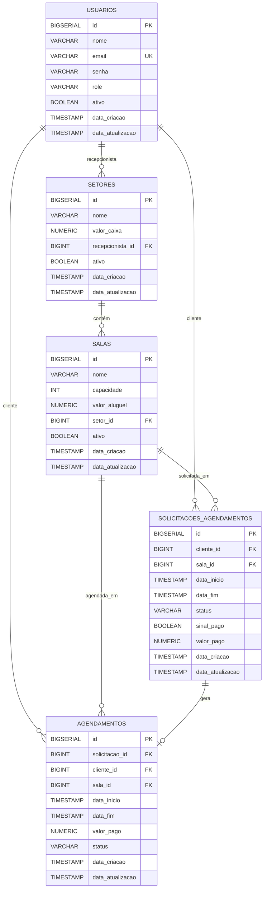

# ReservaSalas: Sistema de Gerenciamento de Espaços

O **ReservaSalas** é um sistema monolítico completo para agendamento de salas, desenvolvido em **Java Spring Boot** e **JSP**. A solução foi criada para otimizar o processo de reservas, oferecendo ferramentas especializadas para três perfis de usuário: **Administrador**, **Recepcionista** e **Cliente**.

-----

## 🛠️ Stack Tecnológica

  * **Backend:** Java Spring Boot (MVC) 
  * **View:** Java Server Pages (JSP) 
  * **Banco de Dados:** PostgreSQL 
  * **Versionamento de BD:** Flyway 

-----

## ✨ Funcionalidades

O sistema foi desenhado para atender aos requisitos de cada perfil, garantindo uma experiência completa e segura.

  * **Gerenciamento de Perfis:**

      * **Cadastro:** Apenas novos Clientes podem se cadastrar livremente. Recepcionistas são adicionados pelo Administrador, e um Administrador padrão é definido via *seed* no DataLoader.java.
      * **Autenticação e Autorização:** Controle de acesso baseado em papéis (roles) para Clientes, Recepcionistas e Administradores garantido pelo SecurityConfig e annotations de @PreAuthorize.

  * **Gestão de Espaços:**

      * **CRUD de Setores:** O Administrador gerencia os setores, que podem ter um Recepcionista e um valor em caixa.
      * **CRUD de Salas:** O Administrador cria e gerencia as salas, definindo capacidade e valor de aluguel. Cada sala pertence a um setor.
      * **Visualização:** Clientes podem visualizar salas disponíveis e seus valores de aluguel.

  * **Fluxo de Agendamento:**

      * **Solicitação:** Clientes solicitam o agendamento de uma sala.
      * **Confirmação:** Recepcionistas confirmam as solicitações, o que gera um agendamento. O Recepcionista pode também fazer um agendamento instantâneo.
      * **Pagamento:** A confirmação exige o pagamento de um sinal de 50% do valor da sala.
      * **Finalização:** Recepcionistas registram a finalização do uso da sala.

  * **Relatórios e Histórico:**

      * O sistema mantém um histórico completo de todas as transações e agendamentos.
      * **Visão do Cliente:** Histórico de todos os seus agendamentos.
      * **Visão do Recepcionista:** Histórico e relatórios dos valores em caixa do seu setor.
      * **Visão do Administrador:** Visão global de agendamentos e transações de todos os setores.

-----

## 🏛️ Arquitetura e Decisões de Design

Claro, aqui está uma versão melhorada do seu texto, com uma redação mais técnica e fluida, mantendo a estrutura proposta:


A arquitetura adotada é **monolítica modular**, alinhada com as tecnologias definidas (Spring Boot e JSP). A organização do código segue o **padrão orientado a funcionalidades (Feature-Oriented Pattern)**, que se integra perfeitamente ao modelo MVC, promovendo alta coesão e baixo acoplamento. Cada funcionalidade do sistema é um módulo autocontido, encapsulando todos os seus componentes, o que facilita a manutenção, o teste e a escalabilidade horizontal da equipe.

A estrutura de um módulo típico segue esta hierarquia:

```
└── (feature)
    ├── controller
    │   └── (Feature)Controller.java
    ├── model
    │   ├── (Feature)Entity.java
    │   └── (Feature)Enums.java
    ├── repository
    │   └── (Feature)Repository.java
    └── service
        ├── (Feature)Mapper.java
        ├── (Feature)Request.java
        ├── (Feature)Response.java
        └── (Feature)Service.java
```

**Vantagens desta abordagem:**

*   **Alta Coesão:** Todos os artefatos relacionados a uma mesma regra de negócio estão agrupados, tornando o código mais intuitivo e fácil de navegar.
*   **Baixo Acoplamento:** Módulos/features possuem dependências mínimas entre si, permitindo que sejam desenvolvidos, modificados e testados de forma isolada.
*   **Maior Legibilidade:** A estrutura é previsível e clara, acelerando o onboarding de novos desenvolvedores.
*   **Escalabilidade da Equipe:** Diferentes squads podem trabalhar em features distintas com menos risco de conflitos de merge e interferência no código alheio.

Essa combinação entre uma arquitetura monolítica modular e a organização por features resulta em um sistema bem estruturado, que mantém as vantagens de simplicidade de um monolito enquanto incorpora a modularidade essencial para projetos de médio e grande porte.

  * **Distribuição da Lógica de Negócio:**

      * **Justificativa:** Conforme o requisito do desafio, mais de 50% da lógica de negócio reside no banco de dados.
      * **Detalhes:**
          * **Implementação em Nível de Banco:** Foram criadas as tabelas de `usuarios`, `setores`, `salas`, `solicitacoes` e `agendamentos`. Aplicado triggers nos momentos julgados como necessário, bem como indexação para melhora de performance.
          * **Implementação na Aplicação:** `A aplicação foi distribuida harmonizamento entre `

  * **Padrões de Projeto:**

      * **Padrão MVC + Service + Repository:** Cada módulo (como `usuario`, `sala`) segue essa estrutura, garantindo a **separação de responsabilidades** e facilitando a manutenção.
      * **Feature Pattern:** 

  * **Segurança e Consistência:**

      * **Spring Security:** A autenticação e a autorização no Spring Security são configuradas utilizando controle de acesso baseado em papéis. O sistema usa @PreAuthorize para garantir que cada usuário só possa acessar as rotas e funcionalidades permitidas de acordo com seu papel (ADMIN, RECEPCIONISTA, CLIENTE). Além disso, a configuração de segurança foi feita para proteger endpoints sensíveis, assegurando que os usuários não autorizados não consigam acessar dados ou realizar ações restritas. A autenticação é realizada por meio de um formulário de login, e as permissões são atribuídas dinamicamente com base no perfil do usuário.
      * **Flyway:** O Flyway foi utilizado para garantir o controle de versão do banco de dados, permitindo o histórico completo de todas as alterações no schema, o que facilita o rastreamento e a reversão de mudanças. Ele assegura a consistência entre os ambientes, garantindo que todos possuam o mesmo schema, e facilita a colaboração entre desenvolvedores ao permitir que múltiplos colaboradores sincronizem suas migrações de forma segura e eficiente.
-----

## 📌 Modelo de Dados

O banco de dados relacional é composto pelas seguintes entidades principais, garantindo a integridade dos dados.



-----

## 🌐 Principais Rotas da Aplicação

| Funcionalidade | URL | Perfil de Acesso |
| :--- | :--- | :--- |
| **Login** | `/entrar` | Público |
| **Criar Conta** | `/criar-conta` | Público |
| **Gerenciar Setores** | `/setores`  | ADMIN, RECEPCIONISTA |
| **Gerenciar Salas** | `/salas` | RECEPCIONISTA, ADMIN |
| **Minhas Solicitações** | `/cliente/solicitacoes` | CLIENTE |
| **Nova Solicitação** | `/solicitacao/criar?salaId={id}` | CLIENTE |
| **Painel Recepcionista** | `/recepcionista` | RECEPCIONISTA |
| **Aprovar Solicitações**| `/recepcionista`| RECEPCIONISTA |

-----
## Dependências utilizadas

🔹 spring-boot-starter-data-jpa

Evita boilerplate ao lidar com persistência de dados, usando JPA e Spring Data. Também ajuda na segurança ao evitar SQL injection por meio de consultas parametrizadas.

🔹 spring-boot-starter-security

Adiciona autenticação e autorização com várias camadas de proteção. Garante segurança com filtros, proteção contra CSRF e controle de acesso por papéis.

🔹 spring-boot-starter-validation

Permite validar dados de entrada com anotações simples (@NotNull, @Email, etc.), garantindo integridade e evitando lógica de validação repetida.

🔹 spring-boot-starter-web

Fornece suporte para APIs REST e páginas web, incluindo servidor embutido (Tomcat), facilitando o desenvolvimento de aplicações web completas.

🔹 flyway-core + flyway-database-postgresql

Garante versionamento seguro e rastreável do banco de dados, evitando inconsistências entre ambientes de desenvolvimento, teste e produção.

🔹 spring-boot-devtools

Acelera o desenvolvimento com hot reload e reinicialização automática da aplicação ao detectar mudanças no código.

🔹 postgresql

Driver JDBC para conexão segura e eficiente com o banco de dados PostgreSQL.

🔹 lombok

Reduz drasticamente o boilerplate ao gerar automaticamente getters, setters, construtores, entre outros, com anotações simples como @Data.

🔹 spring-boot-starter-test

Pacote completo para testes unitários e de integração, com suporte ao JUnit, Mockito e testes Spring, garantindo qualidade do código.

🔹 spring-security-test

Permite testes de segurança, autenticação e autorização, simulando usuários e acessos com facilidade.

🔹 tomcat-embed-jasper

Necessário para compilar e interpretar páginas JSP no Tomcat embarcado, usado na camada de visualização.

🔹 jakarta.servlet.jsp.jstl

Fornece bibliotecas padrão para uso em JSPs (<c:if>, <c:forEach>, etc.), ajudando na organização da lógica de apresentação.

🔹 jakarta.servlet.jsp-api

API essencial para o suporte a JSPs no ambiente de desenvolvimento, usada pelo container para interpretar as páginas.


-----

## ⚙️ Guia de Instalação e Execução

### Pré-requisitos

  * Java JDK 21+
  * Maven 3.8.7+
  * PostgreSQL 16.1+

### 1\. Configuração do Banco de Dados

```bash
# Crie o banco de dados no PostgreSQL
createdb reserva_salas

# No arquivo src/main/resources/application.properties, configure as credenciais:
spring.datasource.url=jdbc:postgresql://localhost:5432/reserva_salas
spring.datasource.username=seu_usuario
spring.datasource.password=sua_senha
```

### 2\. Build e Execução

```bash
# Clone o repositório
git clone https://github.com/vynijales/processo-seletivo-dunnas.git
cd processo-seletivo-dunnas

# Execute a aplicação com Maven
mvn clean install
mvn spring-boot:run
```

O Flyway executará as migrações do banco de dados automaticamente na inicialização.
